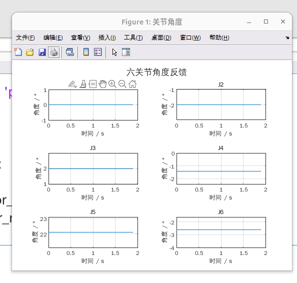
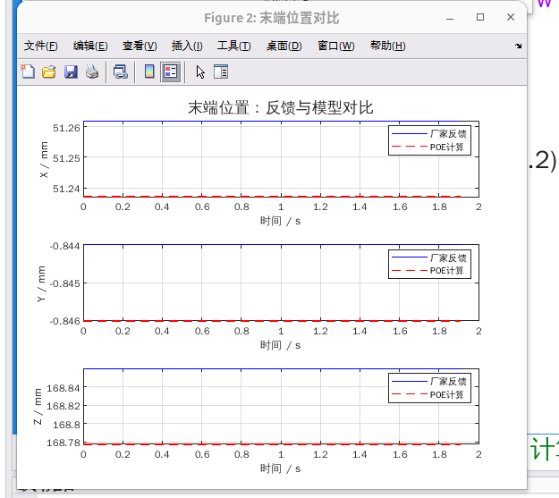
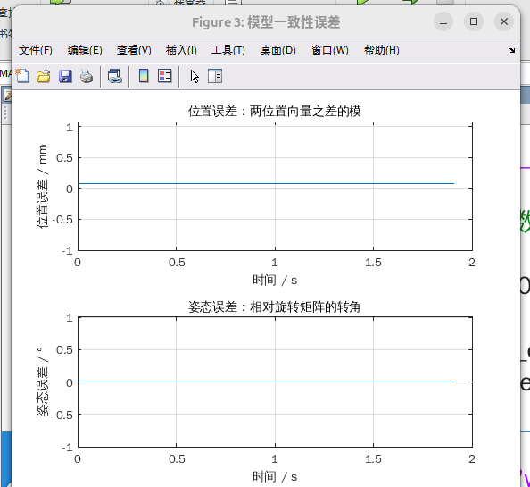
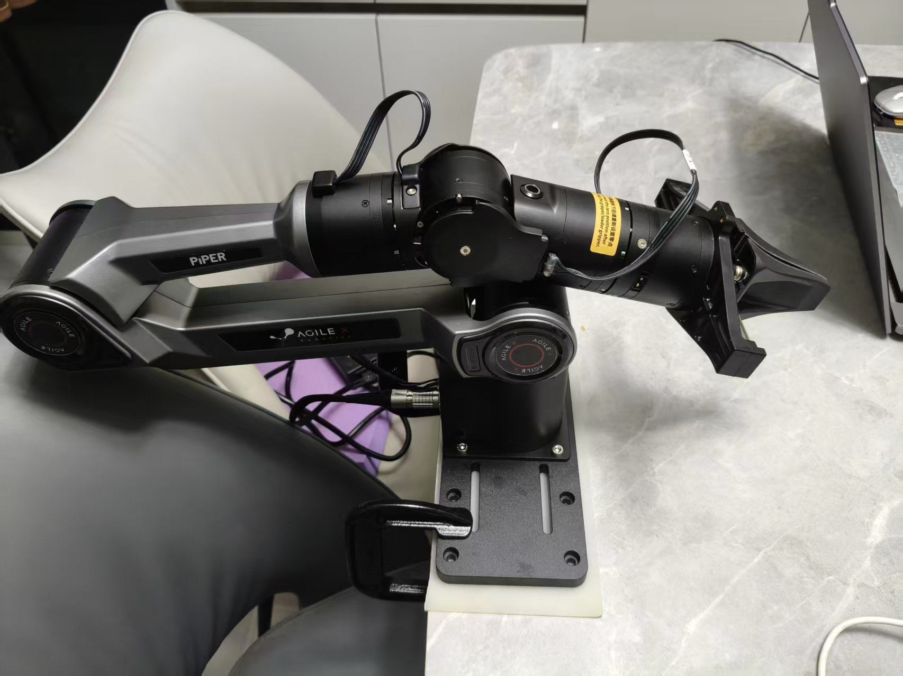
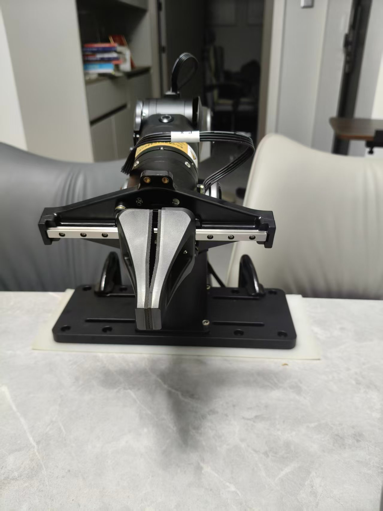

# PiPER 单位形静态正运动学一致性验证

## 1. 实验目的

在一个静止位形下，对比基于 URDF 建立的 C++ POE 模型与厂家 CAN 末端反馈，验证日志解码、CSV 导出和模型一致性。

## 2. 数据与条件

- 整理日期：2026-10-02。
- 机械臂：PiPER 标准版，安装 AgileX 夹爪，无额外负载。
- 实验状态：同一静止位形的重复反馈，不是动态轨迹跟踪实验。
- 输入文件：`data.csv`；原始日志为 `piper_can.log`，不修改原始内容。
- CSV 内长度、角度、时间分别为 m、rad、s。
- 实验归档 Git 提交号：`e2cb9cf`。

## 3. 数据处理方法

1. 读取 CAN 日志，将 `0x2A2～0x2A7` 六帧按不超过 2 ms 的时间窗口配对。
2. 解码六关节角度、末端 XYZ 和 RPY，利用关节角计算 POE 正运动学。
3. 比较 POE 位姿与反馈位姿，导出 `data.csv`。
4. 在 MATLAB 中运行 `matlab_plot.m`，自动读取同目录的 CSV，计算位置与姿态偏差的均值、RMS、最大值并显示图形，不自动保存图片。

相对时间以第一组完整反馈为零点，每组时间戳取六帧中最后一帧的接收时间。

## 4. 实验结果

| 指标                  |           结果 |
| --------------------- | -------------: |
| 原始日志记录数        |           4448 |
| 完整反馈组数          |            383 |
| 位置偏差 / mm         |   约 0.0862005 |
| 姿态偏差 / deg        | 约 0.001213744 |
| 六帧最大接收跨度 / ms |       约 0.824 |

各关节角、末端位置和模型偏差在本次静态记录中基本保持不变。

## 5. MATLAB 结果图

关节角度：展示六关节角度随采集相对时间的变化。

末端位置对比：展示 POE 计算与厂家反馈的 XYZ 曲线。

模型一致性偏差：展示位置与姿态偏差随时间的变化。

## 6. 结论与局限

当前静止位形下，POE 模型与厂家末端反馈基本一致，位置偏差约为 0.0862 mm，日志解码和 CSV 导出流程正常。

- 383 组反馈属于同一位形，不是 383 个独立位形，不能替代多位形验证。
- 厂家反馈不是外部独立测量，本次结果不代表实际定位精度。
- 六帧接收跨度小于窗口不代表同步采样，未验证动态同步或跟踪性能。
- MATLAB 本次用于统计和绘图，没有独立重建 POE 正运动学。

## 7. 照片与视频

本次拍摄机械臂位姿照片 2 张，未记录视频。照片与 MATLAB 结果图保存在本实验的 `figures/` 目录中。

网盘备份：

通过网盘分享的文件：experiments(piper_robot_motion_control)

[实验照片与 MATLAB 结果图](https://pan.baidu.com/s/1YQn_boqRlxiEGFsJ75L62g?pwd=qsp4)

提取码：`qsp4`
