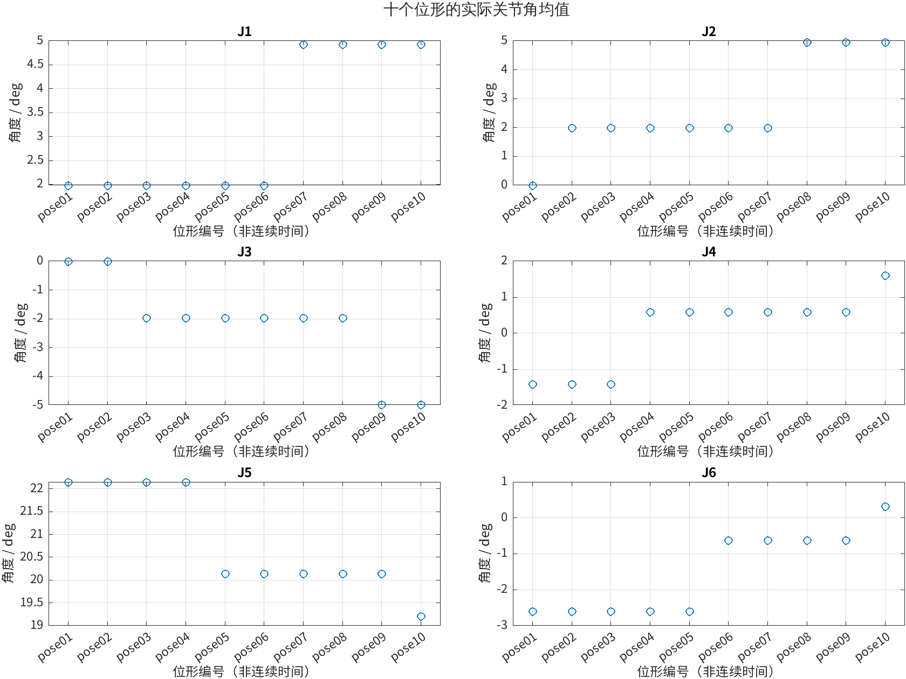
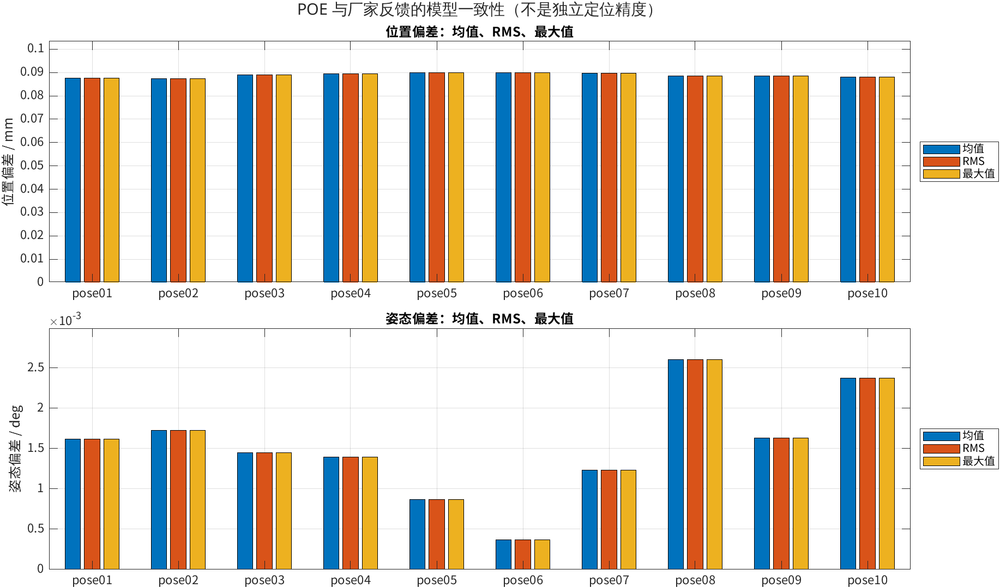
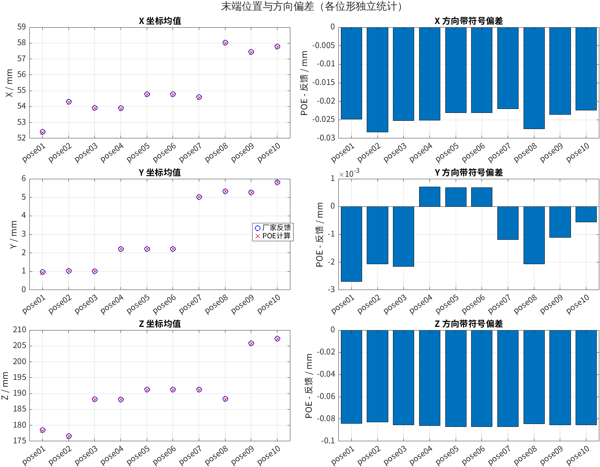
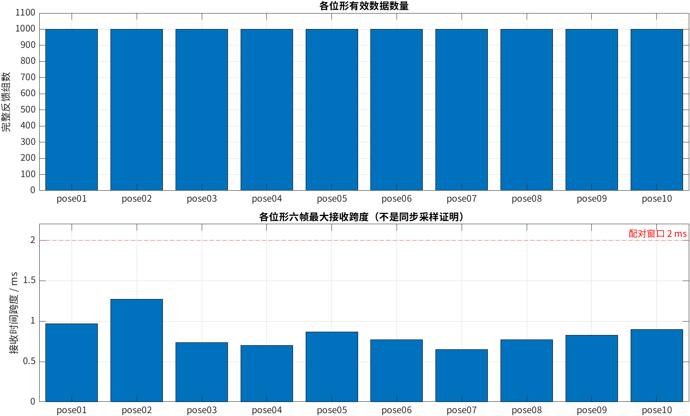

# PiPER 多位形静态正运动学一致性验证

## 1. 实验目的

在十个不同的局部位形下，对比 C++ POE 计算与厂家 CAN 末端反馈，检查数据处理流程和模型一致性。

## 2. 数据与条件

- 采集日期：2026-10-03。
- 机械臂：PiPER 标准版，安装 AgileX 夹爪。
- 每个位形停稳后采集约 5 秒；这是多位形静态实验，不是动态轨迹跟踪实验。
- 输入文件：`data_csv/pose01.csv`～`pose10.csv`；原始日志在 `piper_can_log/`。
- CSV 内长度、角度、时间分别为 m、rad、s。
- 实验归档 Git 提交号：`e2cb9cf`。

## 3. MATLAB 处理方法

1. 检查十个文件、必需数据列、有限数值、时间顺序及非负跨度/偏差。
2. 每个位形独立计算六轴角度均值与变化范围、末端 XYZ 均值。
3. 计算位置与姿态偏差的均值、RMS、最大值，以及六帧最大接收跨度。
4. 从两位置向量重新计算位置偏差，核对 CSV 中的位置偏差列。
5. 保存 `summary.csv`、`analysis_results.mat`，显示图形供使用者检查和自行保存，不自动导出 PNG/FIG。

## 4. 实验结果

| 位形   | 完整反馈组数 | 平均位置偏差 / mm | 平均姿态偏差 / deg | 六帧最大接收跨度 / ms |
| ------ | -----------: | ----------------: | -----------------: | --------------------: |
| pose01 |          999 |       0.087621779 |        0.001619171 |              0.967026 |
| pose02 |         1000 |       0.087486666 |        0.001723362 |              1.271963 |
| pose03 |         1000 |       0.089076864 |        0.001447668 |              0.734091 |
| pose04 |          999 |       0.089532954 |        0.001392115 |              0.702858 |
| pose05 |         1000 |       0.089884029 |        0.000870871 |              0.865936 |
| pose06 |         1000 |       0.089884029 |        0.000367137 |              0.768900 |
| pose07 |         1000 |       0.089637603 |        0.001235397 |              0.652075 |
| pose08 |         1000 |       0.088652370 |        0.002600605 |              0.769854 |
| pose09 |         1000 |       0.088642899 |        0.001630752 |              0.824928 |
| pose10 |          999 |       0.088139125 |        0.002372707 |              0.896931 |

- 总计 9997 组完整反馈，超出 2 ms 配对窗口的组数为 0。
- 各位形平均位置偏差为 0.087486666～0.089884029 mm。
- 最大姿态偏差为 0.002600605°，来自 pose08。
- 各文件内六轴反馈角度的变化范围均为 0（按已记录的数据精度）。
- 同一文件内模型偏差保持不变，因此均值、RMS、最大值相同；这些指标不能作为三个独立证据。
- 位置偏差主要表现为 POE 与厂家反馈之间的稳定 Z 方向偏差；原因尚未确认，不据此直接修改模型参数。

## 5. matlab计算结果图

`figures/pose01_detail.png`～`pose10_detail.png` 分别展示各位形的关节角、末端 XYZ、位置和姿态偏差随该次采集相对时间的变化。
此前生成的图和同名 `.fig` 文件已保留，可用 MATLAB `openfig` 重新编辑；当前脚本不再自动保存图片。

## 6. 结论与局限

本次十个局部静态位形下，POE 模型与厂家末端反馈具有一致性，位置偏差约为 0.09 mm。

- 十个位形覆盖局部测试范围，不代表整个工作空间，重复采样数也不是独立位形数。
- 厂家反馈通常来自其内部运动学模型，不是外部独立测量；本次结果不代表实际定位精度。
- 六帧接收跨度小于窗口不代表同步采样；本次停稳后采集，未验证动态同步或跟踪性能。
- MATLAB 本次进行统计、绘图和位置偏差列复核，没有独立重建 POE 正运动学。

## 7. 照片与视频
由于各关节的运动幅度很小，几乎和零位位姿一样，所以没有进行拍摄。

