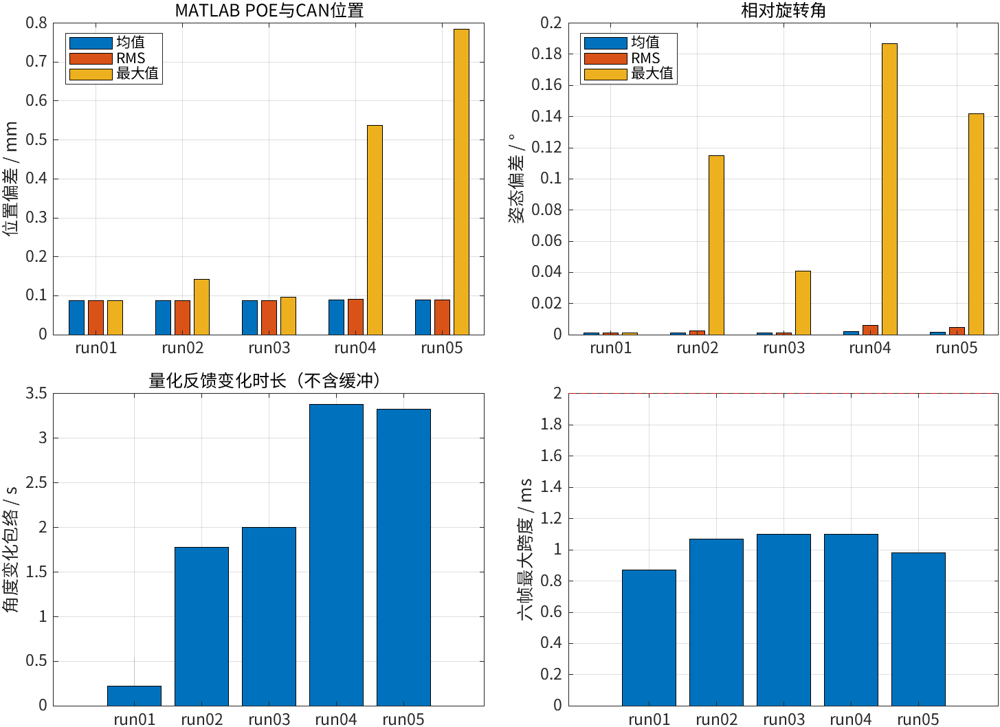
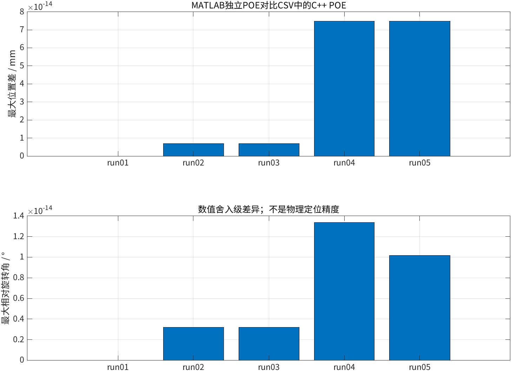
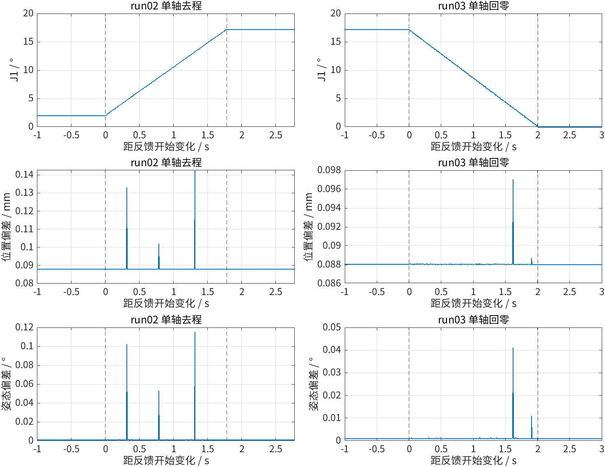
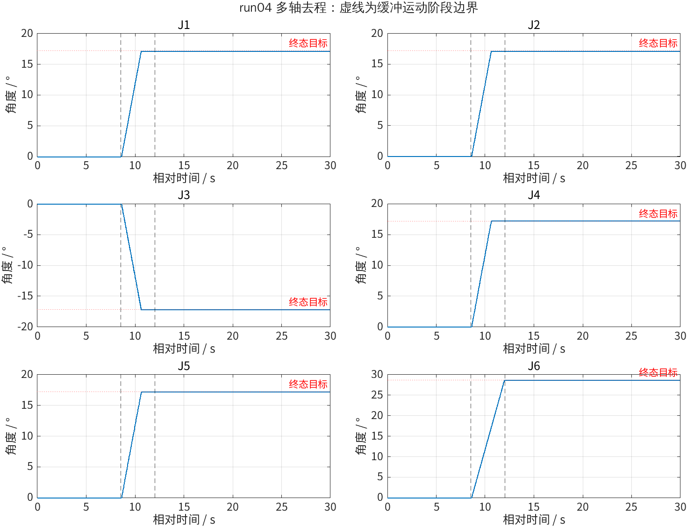
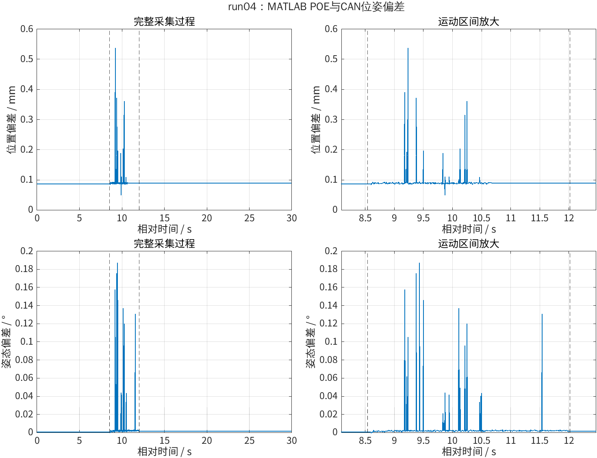
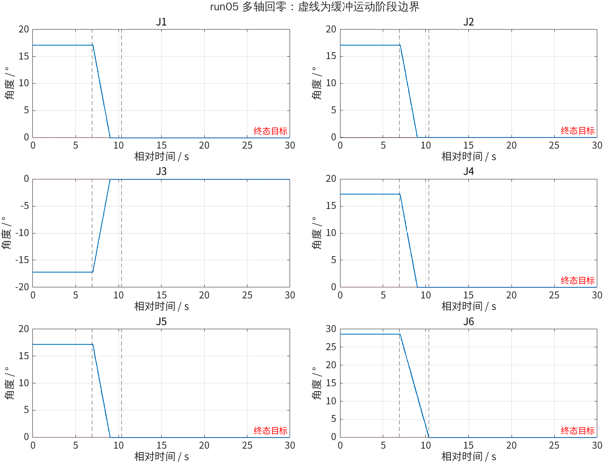
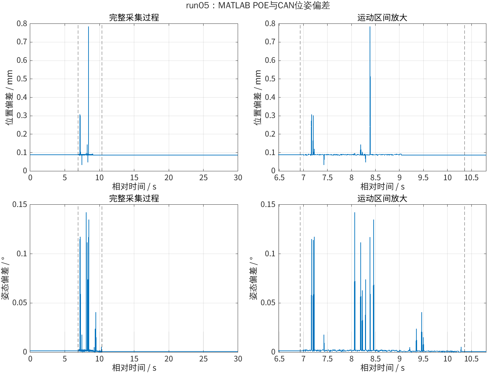

# PiPER 动态正运动学一致性验证

## 1. 实验目的

分析五组运动过程中的 CAN 反馈，以关节角独立计算 MATLAB POE，交叉验证 CSV 中的 C++ POE，并与 CAN 末端位姿比较。重点分析多关节去程 run04 和回零 run05。

## 2. 数据与条件

- 机械臂：PiPER 标准版，安装 AgileX 夹爪。
- 原始日志：`piper_can_log/run01.log`～`run05.log`；输入 CSV：`data_csv/run01.csv`～`run05.csv`，均不修改。
- 五次采集各约 30 s、6000 组完整反馈，共 30000 组；CSV 单位为 m、rad、s。
- 文件夹归档日期为 2026-10-05；CSV 时间戳换算为北京时间对应 **2026-10-04 22:48～23:14**。尚未独立核实采集电脑时钟，不能仅凭文件夹名确定采集日期。
- 操作记录使用 ROS2 MOVE J、`speed_percent:=5`；此数值不是实测关节速度。回零使用 `/move_home`。
- 模型文件：`models/urdf/piper_description.urdf`；MATLAB 使用其建立的 `S_list`、`M`，末端坐标系为模型 link6。安装夹爪不代表已设置夹爪 TCP 偏置。
- C++ / MATLAB 代码提交号：`26a6747`（应对应实际用于本次处理的代码版本）。

| 数据  | 操作记录中的目标关节角 / rad      | 用途                             |
| ----- | --------------------------------- | -------------------------------- |
| run01 | `[0.034907, 0, 0, 0, 0, 0]`       | J1 约 2°的小幅预检               |
| run02 | `[0.3, 0, 0, 0, 0, 0]`            | J1 单轴去程，起点沿用 run01 终态 |
| run03 | `[0, 0, 0, 0, 0, 0]`              | 单轴回零                         |
| run04 | `[0.3, 0.3, -0.3, 0.3, 0.3, 0.5]` | 六关节运动去程                   |
| run05 | `[0, 0, 0, 0, 0, 0]`              | 六关节回零                       |

目标来自手工操作记录，不是与反馈同步记录的指令轨迹。

## 3. MATLAB 处理与运行

脚本：`MATLAB/experiments/project1/2026-10-05_dynamic_fk/matlab_plot.m`（相对仓库根目录）。在 MATLAB 打开并运行该文件，或执行：

```matlab
run('/home/nbw/piper_robot_motion_control/MATLAB/experiments/project1/2026-10-05_dynamic_fk/matlab_plot.m');
```

1. 五个文件分别处理，不拼接相对时间。不删掉静止段，也不平滑或剔除偏差峰值。
2. 检查必需列、有限值、严格递增时间、相对时间一致性、非负偏差与帧跨度、C++ 旋转矩阵合法性。检查相邻样本间隔是否超过本文件中位数的 3 倍，以及六帧跨度是否超过 2 ms。
3. 从 `q1_rad`～`q6_rad` 调用 `forward_poe_space(S_list,q,M)`，独立计算 MATLAB 位姿，与 C++ POE 比较。容差为位置 `1e-9 m`、相对旋转角 `1e-8 rad`。
4. CAN 姿态按 `Rz(yaw)*Ry(pitch)*Rx(roll)` 重建。位置偏差是位置向量差的模，姿态偏差是相对旋转角，不相减 RPY；另复核 CSV 自带的两列偏差。
5. 相邻反馈任一关节变化超过 `0.0005°` 时记为角度变化（对应半个 `0.001°` 量化单位）。第一处变化前一个样本至最后一处变化组成运动包络，前后各加 `0.05 s` 缓冲，分成运动前、缓冲运动段、运动后。阶段互不重复，覆盖所有样本。
6. 各阶段统计位置/姿态偏差的均值、RMS、最大值和峰值时间、样本数、持续时间、最大帧跨度。最后 1 s 的关节角均值与目标比较。空阶段写 NaN，不作为零偏差。

生成文件：

- `analysis/run_summary.csv`：五组全程统计、运动区间、采样检查、终态最大关节偏差与 C++ 交叉验算结果。
- `analysis/phase_summary.csv`：十五个阶段的统计；`pre_static`、`motion_buffered`、`post_static` 分别为运动前、缓冲运动段、运动后。
- `analysis/analysis_results.mat`：逐样本计算结果、终态六关节偏差、阶段标记、模型与分析参数，可用 `load` 继续分析。
- `figures/`：11 张 PNG，文件名以 `matlab_` 开头。重复运行覆盖本脚本生成的同名输出，不修改原始数据、照片或本报告。

## 4. 实验结果

以下偏差均为 **MATLAB POE 与 CAN 位姿的差异**，不是对目标轨迹的跟踪误差。

| 数据  | 反馈角度变化包络 / s | 全程平均位置偏差 / mm | 最大位置偏差 / mm | 最大姿态偏差 / ° | 六帧最大跨度 / ms |
| ----- | -------------------- | --------------------: | ----------------: | ---------------: | ----------------: |
| run01 | 14.265～14.490       |              0.088044 |          0.088084 |         0.000999 |          0.872850 |
| run02 | 3.860～5.640         |              0.088066 |          0.142575 |         0.115009 |          1.067162 |
| run03 | 3.865～5.870         |              0.088042 |          0.097013 |         0.041017 |          1.101017 |
| run04 | 8.590～11.970        |              0.089830 |          0.536706 |         0.186902 |          1.101017 |
| run05 | 6.980～10.310        |              0.088804 |          0.783832 |         0.142058 |          0.978947 |

每个文件检出一段角度变化活动。采样间隔中位数约 5 ms，最大约 5.500 ms；没有超过 3 倍中位数的间隔，也没有超过 2 ms 配对窗口的反馈组。这是对现有 CSV 的检查，不证明底层完全无丢帧或同步采样。

### 4.1. 多关节运动的分阶段结果

缓冲运动段包含包络前后各 50 ms；阶段时长和样本数详见统计表。

| 数据与阶段       | 样本数 | 平均位置偏差 / mm | 位置 RMS / mm | 最大位置偏差 / mm | 姿态 RMS / ° | 最大姿态偏差 / ° |
| ---------------- | -----: | ----------------: | ------------: | ----------------: | -----------: | ---------------: |
| run04 运动前     |   1708 |          0.088039 |      0.088039 |          0.088039 |     0.000999 |         0.000999 |
| run04 缓冲运动段 |    697 |          0.092431 |      0.096511 |          0.536706 |     0.016972 |         0.186902 |
| run04 运动后     |   3595 |          0.090176 |      0.090176 |          0.090176 |     0.001777 |         0.001777 |
| run05 运动前     |   1386 |          0.090176 |      0.090176 |          0.090176 |     0.001777 |         0.001777 |
| run05 缓冲运动段 |    686 |          0.090411 |      0.095001 |          0.783832 |     0.013110 |         0.142058 |
| run05 运动后     |   3928 |          0.088039 |      0.088039 |          0.088039 |     0.000999 |         0.000999 |

- run04 的位置峰值在相对时间 `9.229925 s`，姿态峰值在 `9.429926 s`；对应帧跨度约 `0.599 ms`、`0.601 ms`。
- run05 的位置峰值在 `8.384984 s`，姿态峰值在 `8.064987 s`；对应帧跨度约 `0.602 ms`、`0.599 ms`。
- 峰值集中在运动过程中。接收跨度未超窗不能排除关节与位姿反馈的内部更新时差；当前数据尚不能确定峰值成因，不据此修改旋量或连杆参数。

### 4.2. C++ 交叉验算与终态

30000 组 MATLAB POE 与 CSV 中的 C++ POE 全部通过容差检查：最大位置差约 `7.47e-14 mm`，最大姿态差约 `1.34e-14°`，属于浮点舍入量级。CSV 中的位置与姿态偏差列也通过复核。

最后 1 s，各关节反馈变化范围均为零（按记录精度）。各次终态最大绝对关节角偏差为：run01 `0.037000°`，run02 `0.013734°`，run03 `0°`，run04 `0.050734°`，run05 `0°`。回零反馈为零不代表物理零位误差为零。

### 4.3. 需要保留的异常记录

与 URDF 的关节角边界比较，使用 `0.001°` 容差，发现 **3 组短暂边界越界反馈**：

- run04，相对时间 `8.594965 s`、`8.599958 s`：J2 为 `−0.041°`（URDF 下限 `0°`），J3 为 `+0.028°`（URDF 上限 `0°`）。
- run05，相对时间 `9.004978 s`：J2 为 `−0.040°`。

原始日志中可复核 run04 的 `2A5#0000006FFFFFFFD7`、`2A6#0000001C00000000`，以及 run05 的 `2A5#00000000FFFFFFD8`。这些值不是 MATLAB 换算引入的。保留全部样本并提示警告；本次未同步检查所有关节驱动状态，不能据此认定硬件限位故障。后续先复核零位附近的反馈与驱动状态，不放宽 URDF 限位。

## 5. MATLAB 结果图















补充图：[run04末端XYZ](figures/matlab_run04_末端XYZ对比.png)、[run05末端XYZ](figures/matlab_run05_末端XYZ对比.png)、[run04帧跨度与位置分量](figures/matlab_run04_帧跨度与位置分量.png)、[run05帧跨度与位置分量](figures/matlab_run05_帧跨度与位置分量.png)。

## 6. 结论与局限

本次已完成五组动态反馈分析和独立 MATLAB / C++ POE 交叉验算。静止段位置偏差约 0.09 mm，运动过程存在短时偏差峰值，最大位置偏差 0.783832 mm、最大姿态偏差 0.186902°，分别来自 run05 和 run04。三个零位边界越界反馈样本需保留并复核。

- CAN 末端反馈不是外部独立测量；本实验不代表机械臂真实定位精度。
- 接收时间不是统一硬件采样时刻，2 ms 窗口也不是同步保证。本次未插值或人为移位对齐。
- MATLAB 与 C++ 使用同一标称几何模型：交叉验算检查实现一致性，不能排除两边共同的模型误差。
- 未记录带时间的目标轨迹，不能评价动态跟踪误差、指令响应延迟或完整控制性能；此实验是动态 FK 一致性验证。
- 零位及局部轨迹覆盖有限；没有凭本次结果进行模型标定。

## 7. 照片与视频

本次分析目录尚未提供真机照片或视频。后续精选照片可放入 `figures/` 并补充引用；视频放网盘后补充链接。脚本仅覆盖自己生成的 `matlab_*.png` 同名文件，不处理照片和视频。
